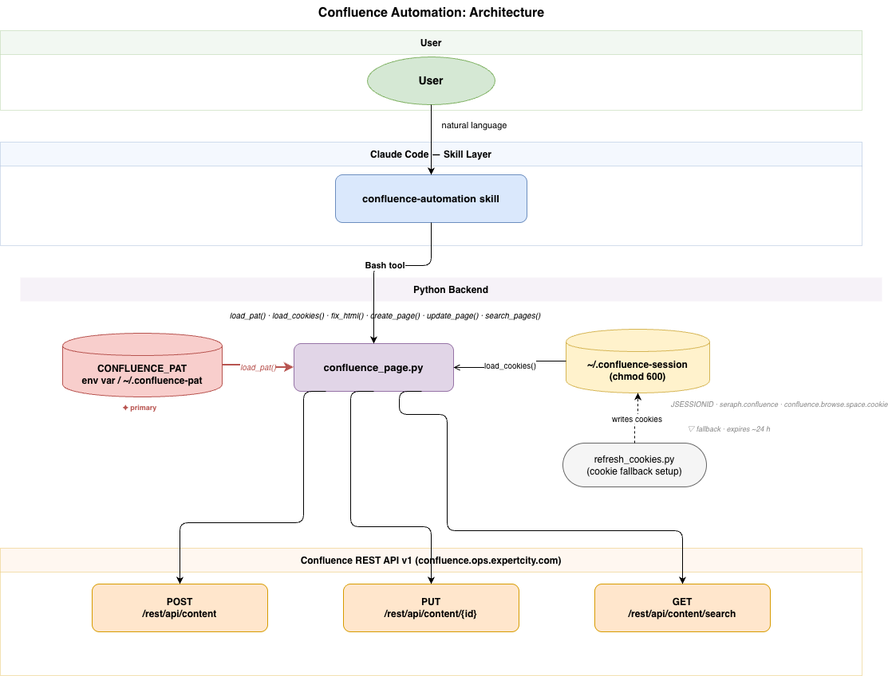

# Design Doc: Confluence Automation — Python Backend + Claude Code Skill

**Author:** Vicky Pandey
**Date:** 2026-05-10
**Status:** Approved
**Audience:** Engineering
**PRD:** [docs/PRD.md](../../docs/PRD.md)
**Reviewers:** Vicky Pandey

---

## Version History

╔═══════════╦════════════╦═══════════════╦═══════════════════════════════╗
║ Version   ║ Date       ║ Author        ║ Summary                       ║
╠═══════════╬════════════╬═══════════════╬═══════════════════════════════╣
║ 1.1       ║ 2026-05-10 ║ Vicky Pandey  ║ LIVE                          ║
╚═══════════╩════════════╩═══════════════╩═══════════════════════════════╝

---

## Problem

Publishing docs to Confluence by hand means navigating a browser editor and memorizing macro syntax. The `confluence-automation` skill needs a stable Python backend that handles page operations automatically. That backend has to work from any clone path, authenticate without asking the user for anything, and produce XHTML the Confluence API will accept.

---

## Goal

A two-layer system: a Python CLI backend (`confluence_page.py`) called via Bash by the `confluence-automation` Claude Code skill, enabling fully automated Confluence page creation, updates, and search from natural language — no browser required.

## Non-Goals

- Multi-user auth (each user configures their own credentials)
- Auto-cookie extraction from Chrome (permanently out of scope; brittle across Chrome versions)
- Web UI, Slack bot, or any interface other than the Claude Code skill

---

## Architecture



**Deployment:** Local macOS dev machine; no cloud infra.
**Data flow:** Synchronous HTTP (`requests` library).
**External dependencies:** Confluence REST API v1 (Cloud or Server/DC), Python 3.9+.

### Components

**`confluence_page.py` — Core CLI**
Entry point for all page operations. Authenticates via PAT token (`CONFLUENCE_TOKEN` env var) if set, falling back to cookie session (`~/.confluence-session`). Creates an authenticated `requests.Session`, calls the Confluence REST API, and prints a structured result including the page URL. Handles 4 commands: `create`, `update`, `read`, `search`.

**`refresh_cookies.py` — Auth Management**
Three modes: `auto` (reads Chrome SQLite DB), `--guided` (opens Chrome + walks user through DevTools), `--manual` (direct input). All modes write to `~/.confluence-session`. Validates all 3 required cookies present before saving. Falls back auto → guided automatically.

**`attach_file.py` / `attach_image.py` — Attachment Helpers**
Attach binary content to a page ID. Use `X-Atlassian-Token: nocheck` header required by Confluence multipart upload. File opened via context manager to prevent resource leaks.

**`convert_drawio_to_png.py` — Diagram Pre-processing**
Converts `.drawio` files to PNG for Confluence embedding. Supports single file and `--batch` directory mode.

**`confluence-automation` skill — AI Interface Layer**
Claude Code skill that intercepts natural language triggers, selects the correct typed HTML template, fills all `{{PLACEHOLDERS}}`, writes to `/tmp/page_$$.html`, calls `confluence_page.py` via Bash, extracts the URL from stdout, reports it, and cleans up temp files. Never asks the user to run commands manually.

**`cf` — Legacy CLI Wrapper**
Bash wrapper calling `confluence.py` (OOP implementation). Kept for compatibility; primary path is `confluence_page.py`.

---

## Key Decisions

### Decision 1: PAT token as primary auth, cookie session as fallback

**Options considered:**
- Cookie auth only: works, but expires every ~24 hours and needs a manual refresh each day
- PAT token only: cleaner and longer-lived, but requires `CONFLUENCE_TOKEN` env var to be set
- PAT + cookie fallback: PAT is primary; cookie session used when the env var isn't set

**Chosen:** PAT + cookie fallback. PAT token is enabled on the on-prem instance now. Engineers set `CONFLUENCE_TOKEN` once in their shell profile and never have to think about auth again. Cookie fallback keeps things working in environments where the env var isn't set.

### Decision 2: Flat CLI as primary backend, not OOP class

**Options considered:**
- `confluence.py` — SOLID-pattern OOP with `AuthProvider` ABC; clean but more surface area
- `confluence_page.py` — flat procedural; each function self-contained, easy to trace from skill Bash output

**Chosen:** `confluence_page.py`. Skill calls it via Bash — flat procedural is easier to trace, error messages are predictable. OOP version kept for compatibility.

### Decision 3: Claude Code skill as sole interface

**Options considered:**
- FastAPI service — adds infra, TLS, auth, always-on process
- Slack bot — adds OAuth, app registration, infrastructure
- Claude Code skill — zero infra, natural language, runs in same context as the engineer

**Chosen:** Skill. Interface is where engineers already work. Zero deployment overhead.

### Decision 4: Typed HTML templates + reference specs

**Options considered:**
- Free-form Claude HTML generation each time — fast but drifts per run
- Typed templates with `{{PLACEHOLDER}}` markers + reference `.md` specs — consistent, auditable

**Chosen:** Typed templates. Confluence pages have institutional structure; free-form generation diverges over time.

╔═════════════════╦═════════════════════════════╦══════════════════════════════════════╗
║ Page Type       ║ Template File               ║ Reference Spec                       ║
╠═════════════════╬═════════════════════════════╬══════════════════════════════════════╣
║ AI Win Story    ║ templates/ai-win-story.html ║ reference/ai_win_story_ref_template  ║
║ Architecture    ║ templates/architecture.html ║ reference/architecture_ref_template  ║
║ Data Flow / ETL ║ templates/data-flow.html    ║ reference/data_flow_ref_template     ║
║ Infra Flow      ║ templates/infra-flow.html   ║ reference/infra_flow_ref_template    ║
║ PRD             ║ templates/prd.html          ║ reference/prd_ref_template           ║
║ User Guide      ║ templates/user-guide.html   ║ reference/user_guide_ref_template    ║
╚═════════════════╩═════════════════════════════╩══════════════════════════════════════╝

---

## Data Model

N/A — no database schema. Auth state stored in `~/.confluence-session` (flat file, chmod 600).

---

## API / Interface

### Skill invocation

```
User: "create a confluence page in ENG space about our new ETL pipeline"
Skill: selects data-flow template → fills placeholders → writes /tmp/page_$$.html
     → python src/confluence_page.py create ENG "ETL Pipeline" /tmp/page_$$.html
     → extracts URL from stdout
     → ✅ Page created! https://your-confluence-instance.com/spaces/ENG/pages/123456
```

### `confluence_page.py` CLI

```
create SPACE "Title" HTML_FILE [PARENT_ID]
update PAGE_ID "Title" HTML_FILE
read   PAGE_ID
search "query" [SPACE]
```

### `refresh-auth` CLI

```
./refresh-auth              # auto → guided fallback
./refresh-auth --guided     # Open Chrome + walk through DevTools
./refresh-auth --manual     # Direct cookie input
```

---

## Security & Access

- **Auth:** PAT token via `CONFLUENCE_TOKEN` env var (primary); cookie session in `~/.confluence-session` at chmod 600 (fallback). Stores session identifiers only.
- **Threat surface:** Outbound HTTPS from local machine to a single on-prem instance. Nothing listens for inbound connections.

---

## Observability

- **Logs:** `confluence_page.py` prints to stdout: either a success URL or a failure code with a human-readable message. The skill surfaces this to the user.
- **Cookie age warnings:** Fires if cookies are older than 12 hours. Non-blocking.
- **Error messages:** Every HTTP error code has a matching human-readable message and a remediation step.

---

## Performance Envelope

- **Expected throughput:** Single-user, single request at a time; no concurrency requirements.
- **Latency SLO (p99):** Page create/update < 5 seconds under normal Confluence response times.
- **Scale ceiling:** Single user, single on-prem Confluence instance. No re-design needed unless multi-user.

---

## Testing Strategy

- **Unit:** Deferred to future milestone. Manual integration testing sufficient for v1.x.
- **Integration:** Manual end-to-end: fresh clone → refresh-auth → create/update/search via skill → verify page URL and content in browser.
- **Load / stress:** N/A — single-user local tool.
- **Rollout gate:** Successful create + update + search from a fresh clone on a clean machine.

---

## Error Handling

╔══════════════════════════════════════╦══════════════════════════════════════════════════════╗
║ Scenario                             ║ Behavior                                             ║
╠══════════════════════════════════════╬══════════════════════════════════════════════════════╣
║ 401 Unauthorized                     ║ exit 1; skill tells user to rotate CONFLUENCE_TOKEN (PAT) or run ./refresh-auth (cookie fallback) ║
║ 400 Bad Request (XHTML)              ║ show response[:500]; skill re-escapes and retries    ║
║ 403 Forbidden                        ║ print space/page permission message                  ║
║ 404 Not Found                        ║ print page ID; skill searches for correct ID         ║
║ 409 Conflict (stale version)         ║ print conflict msg; script re-fetches version        ║
║ Cookie age > 12h                     ║ warn to stdout; continue (non-blocking)              ║
║ Missing ~/.confluence-session        ║ exit 1 with setup instructions                       ║
╚══════════════════════════════════════╩══════════════════════════════════════════════════════╝

---

## Rollout Plan

- **v1.0 (2026-05-01):** Core CLI — create/update/search/read + cookie auth
- **v1.1 (2026-05-10):** Portable paths, attach fix, typed skill templates + reference specs
- **v1.2 (2026-05-22):** PAT token as primary auth; cookie session kept as fallback
- **Rollback:** `git checkout <tag>`. No DB migrations; cookie files out-of-band.

---

## Open Questions

- [x] **Expose `read` in skill?** — CLI-only for v1.x. Raw XHTML output too noisy for skill surface; revisit in a future version with filtered/rendered output.
- [x] **Deprecate `cf` / `confluence.py` (OOP)?** — Deferred to future version. Kept for compatibility; consolidation into single backend tracked as future cleanup.
- [x] **Single-user or shared team tool?** — Single-user by design. Per-user `~/.confluence-session` is acceptable. Parent page ID is configurable via `skill-config.yaml`. No multi-user onboarding needed.
- [x] **Unit tests?** — Deferred to future milestone. Manual integration testing sufficient for v1.x; unit coverage for auth/HTTP logic tracked as future work.

---

## References

- [PRD](./PRD.md)
- [User Guide](./USER-GUIDE.md)
