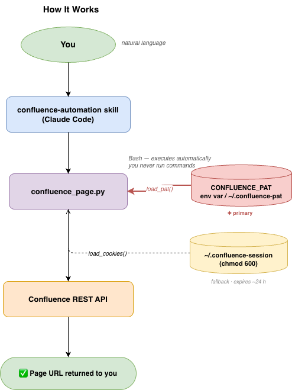

# PRD: Confluence Automation — AI-Powered Page Authoring

**Author:** Vicky Pandey
**Date:** 2026-05-10
**Status:** Approved
**Audience:** Engineering, Data Analysts, AI/ML Engineers, Product Managers
**Version:** 1.1

---

## Version History

╔═══════════╦════════════╦═══════════════╦════════════════════════════════╗
║ Version   ║ Date       ║ Author        ║ Summary                        ║
╠═══════════╬════════════╬═══════════════╬════════════════════════════════╣
║ 1.0       ║ 2026-05-01 ║ Vicky Pandey  ║ Initial draft                  ║
║ 1.1       ║ 2026-05-10 ║ Vicky Pandey  ║ Add skill interface section     ║
╚═══════════╩════════════╩═══════════════╩════════════════════════════════╝

---

## Stakeholders

╔══════════════════╦═══════════════╦═══════════════════════════════╗
║ Role             ║ Name          ║ Responsibility                ║
╠══════════════════╬═══════════════╬═══════════════════════════════╣
║ Owner / Eng Lead ║ Vicky Pandey  ║ Technical decisions, delivery ║
║ Primary Users    ║ Your team / end users  ║ Daily Confluence authoring    ║
╚══════════════════╩═══════════════╩═══════════════════════════════╝

---

## TL;DR

- **What:** Python backend + Claude Code skill that lets engineers and analysts create, update, and search Confluence pages via natural language — no manual browser UI required.
- **Why now:** Manual Confluence authoring is slow, error-prone, and bottlenecks teams publishing documentation at speed (architecture docs, data flows, AI win stories, runbooks).
- **Expected outcome:** Doc publishing time cut from ~30 min (manual) to under 2 min; zero copy-paste errors from cookie mismanagement.

---

## Problem

Data and engineering teams publish documentation to Confluence constantly — architecture docs, ETL pipeline specs, AI win stories, runbooks. Today the workflow is: open Chrome, log in, navigate, format content manually with tribal macro syntax, repeat per update. This takes 20–45 minutes per doc. Cookie sessions expire every ~24 hours causing silent failures. The `confluence-automation` Claude Code skill eliminates this loop — but it requires a stable Python backend to call.

---

## Goals

1. **Automated page ops** — Create, update, search Confluence pages via `confluence_page.py`, callable from the skill via Bash. Success: skill executes end-to-end without user running any command.
2. **Reliable auth** — Cookie refresh completes in under 60 seconds. Success: no 401 failures during a valid session.
3. **Typed templates** — 6 page types with HTML templates + reference specs. Success: every typed page matches template 100%, no free-form drift.
4. **Portable install** — Works from any clone path. Success: no hardcoded paths in scripts.

## Non-Goals

- **Auto-cookie extraction from Chrome** — deferred; Playwright-based extraction is brittle across Chrome updates.
- **Multi-user auth** — each user configures their own PAT; no shared credential management.
- **Web UI or Slack bot** — interface is the Claude Code skill, nothing else.
- **OAuth / token-based auth** — deferred to platform team.

---

## Constraints

- **Tech:** Confluence REST API v1 (compatible with both Atlassian Cloud and Server/DC).
- **Auth lifespan:** PAT tokens last until revoked. Cookies expire ~24 hours; scripts warn at >12 hours and fail gracefully at expiry.
- **HTML format:** API requires valid XHTML storage format with `ac:` macro namespace.

---

## Proposed Solution

Two-layer system: a Python CLI backend and a Claude Code skill as the AI interface.

### System Architecture

### Skill Interface (confluence-automation)

The `confluence-automation` skill is the **primary interface** for all page operations. It triggers on: "confluence", "create page", "update page", "search confluence". It executes via Bash tool automatically — user never runs a command manually. It generates HTML from a typed template, calls the backend, extracts the URL from output, reports it to the user, and cleans up temp files.

**Supported page types:**

╔═════════════════╦═════════════════════════════╦══════════════════════════════════════╗
║ Page Type       ║ Template File               ║ Reference Spec                       ║
╠═════════════════╬═════════════════════════════╬══════════════════════════════════════╣
║ AI Win Story    ║ templates/ai-win-story.html ║ reference/ai_win_story_ref_template  ║
║ Architecture    ║ templates/architecture.html ║ reference/architecture_ref_template  ║
║ Data Flow / ETL ║ templates/data-flow.html    ║ reference/data_flow_ref_template     ║
║ Infra Flow      ║ templates/infra-flow.html   ║ reference/infra_flow_ref_template    ║
║ PRD             ║ templates/prd.html          ║ reference/prd_ref_template           ║
║ User Guide      ║ templates/user-guide.html   ║ reference/user_guide_ref_template    ║
╚═════════════════╩═════════════════════════════╩══════════════════════════════════════╝

### Authentication

`./refresh-auth --guided` opens Chrome with instructions; `--manual` accepts direct input. Both write to `~/.confluence-session` (chmod 600). Scripts auto-check cookie age before every operation — warn at >12 hours, abort cleanly at 401.

### Edge Cases / Error States

- **401:** Skill instructs user to run `./refresh-auth --guided`
- **400 (XHTML parse error):** Skill re-escapes HTML and retries once
- **404 (invalid page ID):** Skill searches for correct ID then retries
- **Duplicate title:** Skill surfaces error with suggestion to search for existing page

---

## Alternatives Considered

╔════════════════════════════════════╦════════════════════════════════════════════════════╗
║ Option                             ║ Rejected because                                   ║
╠════════════════════════════════════╬════════════════════════════════════════════════════╣
║ Atlassian Python SDK               ║ Overkill for 3 operations; adds dep maintenance    ║
║ Browser automation (Playwright)    ║ Brittle, slow, breaks on UI changes                ║
║ Manual copy-paste workflow         ║ Current state — the problem being solved           ║
╚════════════════════════════════════╩════════════════════════════════════════════════════╝

---

## Success Criteria

╔══════════════════════════════╦══════════════════╦══════════════════╦════════════════╦══════════════════════╗
║ Metric                       ║ Baseline         ║ Target           ║ By             ║ How measured         ║
╠══════════════════════════════╬══════════════════╬══════════════════╬════════════════╬══════════════════════╣
║ Time to publish a doc        ║ ~30 min manual   ║ < 2 min via skill║ 2026-06-01     ║ Timed end-to-end     ║
║ Auth failures (401)          ║ > 2/week         ║ 0 per session    ║ 2026-05-20     ║ Script error logs    ║
║ Template compliance          ║ ~50% (ad hoc)    ║ 100% typed pages ║ 2026-06-01     ║ Manual spot-check    ║
║ Portable install             ║ Fails (hardcoded)║ Works any path   ║ Shipped v1.1   ║ Fresh clone + test   ║
╚══════════════════════════════╩══════════════════╩══════════════════╩════════════════╩══════════════════════╝

---

## Dependencies & Risks

╔════════════════════════════════╦════════════════╦══════════════╦══════════════════════════════════════╗
║ Item                           ║ Type           ║ Owner        ║ Mitigation                           ║
╠════════════════════════════════╬════════════════╬══════════════╬══════════════════════════════════════╣
║ Confluence cookie expiry       ║ Risk           ║ Users        ║ refresh-auth + age warnings          ║
║ Confluence REST API changes    ║ Risk           ║ Vicky Pandey ║ Pin to v1 API; monitor on upgrades   ║
║ Chrome cookie format changes   ║ Risk           ║ Vicky Pandey ║ Manual fallback always available     ║
║ Python 3.9+ on dev machines    ║ Dependency     ║ Users        ║ venv + requirements.txt              ║
╚════════════════════════════════╩════════════════╩══════════════╩══════════════════════════════════════╝

---

## Timeline

╔══════════════╦═══════════════════════════════════════════════╦═══════════════╦══════════════╗
║ Phase        ║ Scope                                         ║ Owner         ║ Date         ║
╠══════════════╬═══════════════════════════════════════════════╬═══════════════╬══════════════╣
║ v1.0         ║ Core CLI: create/update/search + auth         ║ Vicky Pandey  ║ 2026-05-01   ║
║ v1.1         ║ Portable paths, attach fix, skill templates   ║ Vicky Pandey  ║ 2026-05-10   ║
║ v1.2         ║ PAT token auth (primary), cookie fallback     ║ Vicky Pandey  ║ 2026-05-22   ║
║ v2.0 (next)  ║ Public release: install.sh, cloud support     ║ Vicky Pandey  ║ 2026-05-23   ║
╚══════════════╩═══════════════════════════════════════════════╩═══════════════╩══════════════╝

---

## Go-to-Market

- **Distribution:** Public GitHub repo at `https://github.com/dev-vpandey/ai-confluence-automation`
- **Install:** Single `./install.sh` command; no manual configuration steps
- **Supported:** Atlassian Cloud and Server/DC

---

## References

- [Design Doc](./DESIGN-DOC.md)
- [User Guide](./USER-GUIDE.md)
